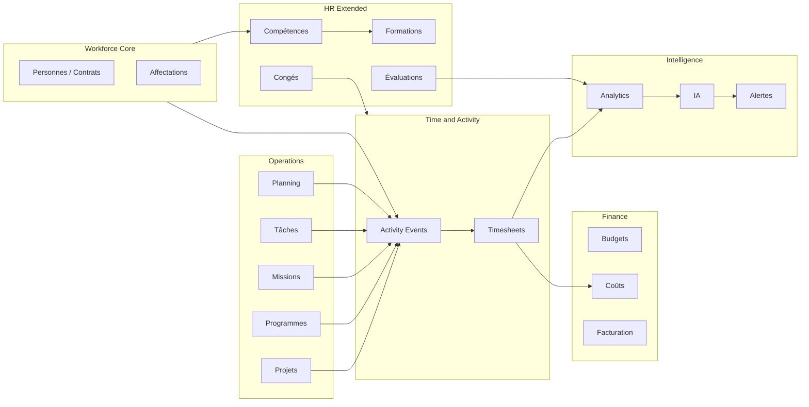

# COYA ERP — Human Capital & Workforce Intelligence OS

**Statut :** architecture cible (référence stratégique)  
**Positionnement :** noyau transversal « Workforce Operating System » / « Human Operations Intelligence Layer »  
**Public :** produit, engineering, données, conformité, direction métier  

---

## Table des matières alignée livrables

1. [Vision stratégique globale](#1-vision-stratégique-globale)  
2. [Architecture fonctionnelle complète](#2-architecture-fonctionnelle-complète)  
3. [Architecture modulaire](#3-architecture-modulaire)  
4. [Schéma des interactions multi-modules](#4-schéma-des-interactions-multi-modules)  
5. [Flux des données](#5-flux-des-données)  
6. [Modèle logique des données](#6-modèle-logique-des-données)  
7. [KPIs métiers](#7-kpis-métiers)  
8. [KPIs RH](#8-kpis-rh)  
9. [KPIs projets](#9-kpis-projets)  
10. [KPIs performance](#10-kpis-performance)  
11. [Workflows détaillés](#11-workflows-détaillés)  
12. [Cas d’usage réels](#12-cas-dusage-réels)  
13. [UX/UI métier détaillée](#13-uxui-métier-détaillée)  
14. [Structure dashboards](#14-structure-dashboards)  
15. [Système d’alertes intelligentes](#15-système-dalertes-intelligentes)  
16. [Système de scoring](#16-système-de-scoring)  
17. [Système GPEC complet](#17-système-gpec-complet)  
18. [Système IA prédictif](#18-système-ia-prédictif)  
19. [Gouvernance & sécurité](#19-gouvernance--sécurité)  
20. [Architecture RBAC/ABAC](#20-architecture-rbacabac)  
21. [Plan d’industrialisation](#21-plan-dindustrialisation)  
22. [Roadmap MVP → Enterprise](#22-roadmap-mvp--enterprise)  
23. [Recommandations stratégiques](#23-recommandations-stratégiques)  
24. [Risques & mécanismes anti-dérive](#24-risques--mécanismes-anti-dérive)  
25. [Standards modernes ERP/SIRH](#25-standards-modernes-erpsirh-à-appliquer)  
26. [Chronologie comportementale & sessions d’activité](#26-chronologie-comportementale--sessions-dactivité)  

---

## 1. Vision stratégique globale

**Principe directeur.** Dans COYA, le temps humain n’est pas une donnée administrative isolée : c’est une **preuve opérationnelle d’activité** reliée à la valeur (projets, programmes, missions), au coût (finance, paie), à la capacité (planning) et au développement des personnes (GPEC, formation).

**Objectif.** Transformer le pointage classique en **moteur de pilotage** :

- traçabilité opérationnelle et conformité ;
- corrélation multi-modules en continu ;
- analytique et signaux prédictifs (sans remplacer le jugement manager/RH) ;
- configurabilité multi-entités, multi-sites, multi-calendriers, multi-contrats.

**Comparable marché (benchmark comportements produit).** SAP SF / Workday (talent & temps enterprise), Oracle HCM (règles & payroll), Odoo (modularité PME), Jira/Monday (activité & livrables), terrain/offline (Solutions mobiles GTA). COYA se différencie par **projets/programmes/missions/ONG**, multi-sites réels et **contexte africain** (connectivité, délégation terrain, bailleurs).

---

## 2. Architecture fonctionnelle complète

### Couches métier

| Couche | Rôle |
|--------|------|
| **Identité & rattachements RH** | Personnes physiques/morales, statuts (salarié, consultant, volontaire…), contrats, sites, départements, hiérarchie, compétences de référence. |
| **Temps & activités** | Horloges, sessions présence, timesheets, imputation (projet, tâche, programme, client, département, objectif). |
| **Planning & capacité** | Modèle de charge, disponibilité, shifts, rotations, contraintes légales/contractuelles. |
| **Productivité & rendement** | Distinction temps présent / productif / facturable / interne ; SLA et jalons. |
| **Coût & valorisation** | Taux horaire, grille paie, règles HS/absences, coût complet employé, marge projet. |
| **Performance & objectifs** | OKR/KPI individuels/équipe, évaluations, primes (liées avec garde-fous). |
| **GPEC & développement** | Référentiel compétences, gaps, formations, mobilité, succession. |
| **Intelligence** | Agrégations, anomalies, prédictions, recommandations ; explainabilité. |
| **Gouvernance** | Workflow validation, audit, rétention, confidentialité. |

### Fonctions « intelligent pointage » (socle)

- Pointage horaire multi-canaux (web, mobile, borne, QR/NFC selon politique).
- Présence / absence / retard ; pauses structurées.
- Heures supplémentaires avec **règles paramétrables** (seuils, compensation).
- Missions terrain (ordre de mission, frais, géofencing optionnel).
- Télétravail / hybride (modes de travail, preuve minimale configurable).
- **Imputation obligatoire ou semi-libre** selon politique organisationnelle : tâche, projet, programme, client, département, objectif.

Pour chaque enregistrement : **collecte → normalisation → validation → historisation → exposition analytics**.

---

## 3. Architecture modulaire

### Modules logiques recommandés

```
Workforce Core          → identités métier, affectations, profils temps
Time & Attendance       → horaires, pointages, absences, règles
Activity Engine         → tâches/missions/activités contextuelles
Planning Engine         → capacité, charge, slots
Payroll Connector       → règles paie (natif ou connecteur)
Workforce Analytics     → agrégats, cubes, indicateurs
GPEC / Skills           → référentiels, matrices, plans
AI / Recommendation     → signaux + reco horizontales
Governance              → workflow, audit, ABAC policy store
Integration Layer       → bus d’événements, API, ETL
```

**Principe.** Faible couplage : chaque moteur consomme des **événements canoniques** et publie des **faits dérivés** (tables de synthèse, vues matérialisées).

---

## 4. Schéma des interactions multi-modules



**Contrats d’intégration.** Chaque module exposé à COYA doit fournir : identifiants stables (org, person_id, assignment_id), périmètre temporel, granularité minimale d’imputation, et politique de visibilité (RBAC/ABAC).

---

## 5. Flux des données

### Chaîne de traitement

1. **Capture** : événements bruts (`clock_in`, `task_focus_start`, `mission_check_in`, etc.).
2. **Enrichissement** : contexte (projet actif, shift prévu, site, device, IP si politique).
3. **Normalisation** : fuseau horaire, arrondis réglementaires, dédoublonnage.
4. **Règles métier** : eligibility télétravail, mission obligatoire, durées minimales de pause.
5. **Validation** : manager/RH/auto-validation selon workflow.
6. **Calcul dérivé** : heures travaillées, HS, retard, coût, burn projet.
7. **Publication** : API read-models, dashboards, exports.
8. **Archivage** : snapshots réglementaires, immutabilité post-clôture période paie.

**Temps réel.** Stream (ex. événements) pour cockpit ; batch pour consolidations lourdes (mois paie, GPEC).

**Offline.** File locale signée + idempotency keys ; résolution conflits par politique (dernier connu gagne vs arbitrage manager).

---

## 6. Modèle logique des données

### Entités cœur (conceptuel)

- **Organization**, **LegalEntity**, **Site**, **CostCenter**, **Department**
- **Person** (≠ login tout seul), **WorkerParty** (salarié, prestataire, volontaire)
- **EmploymentContract** (multi-contrats, dates, régime, FTE)
- **Job**, **Position**, **Assignment** (rattachement opérationnel)
- **WorkPattern** / **Schedule**, **Shift**, **Rotation**
- **TimeClock**, **PresenceSession**, **WorkBreak**
- **TimeEntry** (granularité fine) avec attributs :
  - `started_at`, `ended_at`, `duration_seconds`
  - `activity_kind` (projet, tâche, programme…)
  - `dimensions[]` : `{ type: project | programme | task | client | dept | objective, id }`
  - `productive_flag`, `billable_flag`, `source`, `device_id`, `geo_*` (opt.), `validation_state`
- **LeaveRequest**, **Absence**, **OvertimeRequest**
- **MissionOrder**, **MissionExpense** (liaison terrain)
- **PerformanceObjective**, **CompetencyProfile**, **SkillAssessment**, **TrainingPlan**
- **DerivedAggregate** (jour/semaine/période par worker × dimensions)
- **AuditLog**, **PolicyDecision** (traçabilité ABAC)

**Historisation.** Versions pour contrats, grilles salaires, règles ; événements append-only pour le temps validé.

---

## 7. KPIs métiers

| KPI | Définition opérationnelle |
|-----|---------------------------|
| Taux de conformité pointage | % journées complètes / conformes politique |
| Délai moyen de validation temps | temps entre fin période et validation manager |
| Taux d’imputation analysable | % heures avec ≥1 dimension métier renseignée |
| Écart plan vs réel (charge) | heures prévues planning − heures constatées |
| Dérive projet | Σ temps réel / budget temps projet |
| Marge projet après RH | CA/devis − coût RH chargé |
| Couverture objectifs | % OKR avec progression mise à jour sur horizon |

---

## 8. KPIs RH

- Absentéisme (maladie, non justifié, motif)
- Retard chronique (écart récurrent vs shift)
- Turnover volontaire/involontaire (avec délai de perception)
- Pyramide des âges / ancienneté / FTE par site
- Indice charge moyenne (heures / capacité contractuelle)
- Indice fatigue opérationnelle (proxy : HS cumulées, pauses manquantes, patterns)
- Couverture compétences critiques (% postes couverts vs exigence)

---

## 9. KPIs projets

- **Burn rate** temps : consommation budget heures / période
- **SPI/CPI simplifiés** (adaptés COYA) : avancement jalons vs temps consommé
- Rentabilité ressource : coût chargé / revenu affecté
- Densité incidents / retard livrables (corrélation charge)
- Respect SLA support lié projet (si module ticket relié)

---

## 10. KPIs performance

- Productivité relative : sortie normalisée (tâches clôturées, points story, livrables) / heure productive
- Taux de complétion des formations assignées
- Progression scoring compétences (avant/après formation)
- Objectifs atteints / dépassés / en risque
- Efficacité managerale : délais validation, qualité feedback (si formalisé)

---

## 11. Workflows détaillés

### WF1 — Journée type salarié

Pointage ou déclaration présence → Imputation activités → Soumission feuille de temps → Validation N+1 → Verrouillage partiel → Clôture période RH → Export paie.

### WF2 — Mission terrain

Création ordre de mission → validation → check-in/out mission → frais → consolidation temps mission vs projet/programme.

### WF3 — Heures supplémentaires

Détection règle → demande ou auto-flag → validation → affectation compensation ou paiement.

### WF4 — Anomalie charge

IA/heuristique détecte surcharge → alerte manager + RH → proposition réaffectation / recrutement intérimaire / priorisation backlog.

### WF5 — GPEC

Évaluation compétences → gap → plan formation → corrélation post-formation (fenêtre temporelle) avec performance projet.

---

## 12. Cas d’usage réels

1. **ONG multi-sites** : volontaires + CDI ; temps sur programmes bailleurs ; reporting donateur.
2. **ESN / bureau études** : facturable vs interne ; taux occupation vs bench.
3. **Institution** : forte conformité ; workflows validation hiérarchiques ; archives légales.
4. **Hybride terrain/bureau** : missions géolocalisées ; mode hors-ligne ; resynchronisation.
5. **Programme multi-projets** : consolidation temps par axe stratégique (impact M&E).

---

## 13. UX/UI métier détaillée

### RH Administration

- Vue effectifs et filtres (site, contrat, état)
- File anomalies + routing workflows
- Conformité (jour ouverts/non ouverts, règles pays)

### Managers

- **Charge équipe** heatmap semaine
- Validation temps en masse + drill-down par collaborateur/projet
- Objectifs et feedback léger (sans substitut bilan annuel si légal)

### Employés

- Pointage 1–2 taps ; état journée clair ; demandes congés/HS
- Vue « mission du jour » liée planning + tâches

### Direction

- Cockpit exécutif : productivité agrégée, coût RH projet/programme, alertes rouges

**Principes UX.** Mobile-first terrain ; seuils d’alerte visibles ; aucune métrique « punitive » sans contexte (charge, données manquantes).

---

## 14. Structure dashboards

| Dashboard | Widgets types |
|-----------|----------------|
| RH | absentéisme, validation en retard, anomalies pointage, conformité pauses |
| Manager | charge vs capacité, retard équipe, top projets consommés |
| Projet | burn budget temps, écart prévu/réel, coût RH |
| Finance | coût RH par centre, prévision fin de période |
| Executive | synthèse multi-site, risques, tendances IA (avec disclaimer) |

Technique : couches **semantic metrics** (nom stable + définition versionnée) pour éviter les KPI contradictoires.

---

## 15. Système d’alertes intelligentes

**Catégories.** Temps, charge, conformité, projet (dérive), santé organisationnelle (patterns préoccupants).

**Niveaux.** Info → Attention → Critique → Escalade hiérarchique configurable.

**Sources.** Règles déclaratives + modèles statistiques (avec seuils de confiance).

**Anti-bruit.** Fenêtres glissantes, dédup, heures silencieuses, préférences utilisateur dans les limites légales.

---

## 16. Système de scoring

Scores composites **versionnés** et **explicables** :

- Performance opérationnelle (sortie / temps productif, qualité jalons)
- Employabilité interne (polyvalence, certifications)
- Leadership potentiel (si données RH disponibles — toujours encadré)
- Risque turnover / burnout (**scores exploratoires**, pas décisions automatiques seules)

Chaque score doit exposer : entrées utilisées, date calcul, fourchette, limitations légales (France/Afrique selon déploiement).

---

## 17. Système GPEC complet

- Référentiel métiers × compétences × niveaux
- Évaluation multi-sources (auto, manager, pairs si culture OK)
- Matrice polyvalence équipe/site
- Détection écarts vs besoins projet/programme à horizon T+N
- Plans : formation, mobilité, succession pour postes critiques
- **Boucle fermée** : formation → activités projet → variation indicateurs (efficacité, erreurs, délais)

---

## 18. Système IA prédictif

**Usages.** Absentéisme, surcharge, turnover intentionnel (avec éthique), sous-performance relative, recommandation formation/réaffectation.

**Garde-fous.** Pas de décision juridique automatisée ; transparence ; contrôle humain ; biais géographique/site surveillés ; anonymisation agrégats.

**Architecture.** Features store + modèles batch ; scoring online léger ; monitoring dérive modèle.

---

## 19. Gouvernance & sécurité

- Audit trail append-only sur validations paie et corrections temps
- Séparation des rôles (qui peut modifier après clôture)
- Rétention donnée par catégorie et juridiction
- Chiffrement au repos / en transit ; vault secrets
- DPIA pour biométrie/géoloc si activées
- Plans de continuité offline et réconciliation

---

## 20. Architecture RBAC/ABAC

**RBAC.** Rôles templates (Employé, Manager, RH, Direction, Auditeur, Finance).

**ABAC.** Attributs : org, site, équipe, projet/programme, niveau sensibilité données santé/finance, type contrat, pays.

**Policy Engine.** Évaluation centralisée des permissions sur lectures agrégées vs données nominatives.

**Personnalisation utilisateur.** Portfolios dashboard sous contrainte policy ; pas d’élévation de privilège par préférences.

---

## 21. Plan d’industrialisation

1. Cartographie données existantes COYA (présence, time tracking, RH, projets).
2. Définir **schéma d’événements canonique** + contrats API internes.
3. Introduce **read models** (ex. `workforce_daily_facts`) avant IA lourde.
4. Pipelines ETL/ELT vers entrepôt optionnel (Phase Enterprise).
5. Observabilité : métriques pipeline, SLAs calculs, alertes prod.
6. Documentation métrique « définition unique » + lineage Données.

---

## 22. Roadmap MVP → Enterprise

### MVP (foundations)

Événements temps minimaux, imputation projet/tâche, validation manager simple, dashboards basiques, audit léger, RBAC standard.

### Phase 2

Planning capacité, coût RH projet, règles HS/absences avancées, exports réglementaires, alerting métier.

### Phase 3

GPEC intégré, IA prédictive contrôlée, offline mature multi-site, ABAC complet, entrepôt analytique.

---

## 23. Recommandations stratégiques

1. **Ne jamais laisser le temps hors contexte** : au minimum une dimension métier ou une justification configurable.
2. **Investir tôt dans les événements** ; retarder le « tout IA » avant qualité données.
3. **Semantic layer KPI** pour aligner Finance / Projets / RH sur les mêmes définitions.
4. **Design juridique par pays** : templates règles paramétrables plutôt que code figé.
5. Positionnement marché : **ERP terrain & programmes** avec Workforce OS transversal.

---

## 24. Risques & mécanismes anti-dérive

| Risque | Mitigation |
|--------|------------|
| Surveillance excessive | Politiques minimales de collecte ; revues légales ; transparence employé |
| KPI gaming | Contrôle croisé événements, audits spot, diversité d’indicateurs |
| Biais IA | Tests équité, segments site/rôle, override humain |
| Complexité configuration | Packages sectoriels prêts à l’emploi ONG/PME/institution |
| Divergence modules | Master data RH unique ; governance événements |

---

## 25. Standards modernes ERP/SIRH à appliquer

- Modèle **party / role / contract** (flexibilité statuts travailleurs)
- **Event sourcing partiel** ou événements métier immuables pour le temps validé
- **API-first** et webhooks pour paie / BI tiers
- **ID federation** et audits SOC2-oriented patterns si SaaS
- **Accessibility & i18n** (FR/EN + extensions locales)
- Alignement concepts **SHIFT**, **TIME ACCOUNT**, **WORKFORCE DIMENSION** (inspirations SAP/ORACLE)
- Bonnes pratiques **privacy by design** (RGPD et équivalents locaux)

---

## 26. Chronologie comportementale & sessions d’activité

Les états « présent / absent / pause » ne suffisent pas à décrire le travail moderne. COYA modélise une **timeline continue** par personne : segments (connexion système, activité métier, productivité, collaboration, pause déclarée, inactivité, hors système avec **contexte productif**), puis **consolidation multi-device** (une journée unique, pas de double comptage).

Les scores (activité, productivité, focus, collaboration, efficacité) et les **hypothèses d’interprétation** (surcharge, affectation, friction workflow, etc.) doivent rester **non punitifs** et **explicables** — voir le document détaillé :

- **[BEHAVIORAL-TIMELINE-SESSION-MODEL.md](workforce-os/BEHAVIORAL-TIMELINE-SESSION-MODEL.md)**  
- Types de contrat TypeScript : `services/workforce/types/sessionTimelineModel.ts`

---

## Concept central — Activity Event Engine

Chaque action utilisateur pertinente produit un **événement normalisé** :

| Champ conceptuel | Description |
|------------------|-------------|
| `event_id` | UUID |
| `occurred_at` | UTC + timezone locale affichage |
| `actor_worker_id` | Personne métier |
| `verb` | clock_in, task_completed, mission_started, … |
| `object_refs` | Liens typés vers projet, tâche, programme… |
| `payload` | Données spécifiques non destructrices |
| `integrity` | Signature device / hash chaîne audit |

Les **moteurs** (Time, Activity, Planning, Payroll connector, Analytics, IA) ne font que **réagir** à ces événements ou à leurs agrégats.

---

## Alignement avec l’existant COYA (lecture technique rapide)

Le codebase dispose déjà de briques à **monter en événements** et **read-models** : présence (`presence_sessions`, statuts), time tracking projet (`TimeTracking`), rattachements projets/programmes, politiques présence RH (`HrAttendancePolicy`), synchronisation tâches/planning. La trajectoire naturelle est **d’unifier** ces flux sous le contrat **Activity Event** ci-dessus sans casser les écrans existants (adaptateurs).

---

*Document généré pour COYA ERP — Human Capital & Workforce Intelligence OS. Évolution continue : lier aux migrations Supabase et au registre métrique officiel quand créés.*
